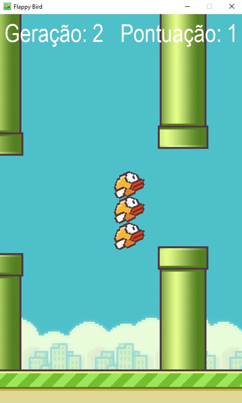

# Flappy Bird em Python

Este repositório contém a implementação do icônico jogo "Flappy Bird" em Python, incluindo uma Inteligência Artificial (IA) que aprende a jogar e pode até zerar o jogo.

## Descrição do Projeto

O projeto é uma recriação do famoso jogo Flappy Bird, onde o jogador controla um pássaro que deve passar por canos sem colidir. A implementação inclui duas modalidades de jogo:

- **Usuário Jogando**: O jogador controla o pássaro pressionando a tecla de espaço para fazê-lo voar.
- **IA Jogando**: Uma IA treinada usando o algoritmo NEAT (NeuroEvolution of Augmenting Topologies) que aprende a jogar e pode alcançar altas pontuações.

## Imagens do Jogo

### Usuário Jogando


### IA Jogando


### IA Zerando o Jogo


## Estrutura do Repositório

- `config.txt`: Arquivo de configuração para a IA, contendo parâmetros para o algoritmo NEAT.
- `game.py`: Código principal do jogo, onde a lógica do Flappy Bird é implementada.
- `game_ai.py`: Código que integra a IA ao jogo, permitindo que a IA jogue e aprenda a partir de suas experiências.

## Requisitos

Para executar o jogo, você precisará ter o Python e a biblioteca Pygame instalados. Você também precisará da biblioteca NEAT-Python para a parte da IA.

### Instalação

1. Clone o repositório:
   ```bash
   git clone https://github.com/seu_usuario/flappy-bird-python.git
   ```

2. Instale as dependências:
   ```bash
   pip install pygame neat-python
   ```

## Como Jogar

Para jogar como usuário, execute o seguinte comando:
```bash
python game.py
```

Para jogar com a IA, execute:
```bash
python game_ai.py
```
